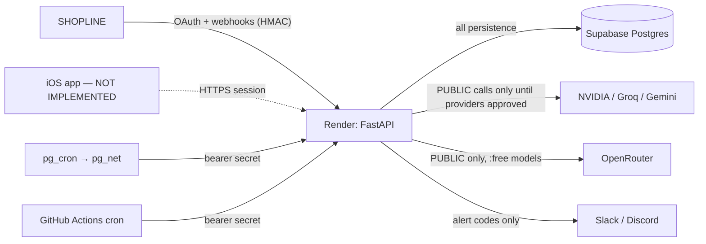

# 02 — Data Flow Map

_Generated 2026-09-27 by scripts/gen_compliance.py from the implemented code._

Scope of this audit: the backend repository `maa-shopline-backend` as of 2026-09-27 (FastAPI app, Supabase migrations 0001–0003, GitHub workflows, render.yaml). and the SwiftUI app in `ios/` (XcodeGen project, no third-party packages). The iOS source has been statically reviewed but **not yet compiled**: the first compile runs on the GitHub macOS runner (`.github/workflows/ios.yml`). Nothing here was verified against live dashboards.

Merchant-confidential data can reach a model provider only if that provider is added to `APPROVED_FOR_MERCHANT_DATA` (currently empty), so today every merchant-data AI call queues instead of leaving MAA's infrastructure. Webhook bodies are parsed in memory and not stored.

| source | destination | data | purpose | protocol | leaves_region | persisted |
|---|---|---|---|---|---|---|
| SHOPLINE | Render API /auth/shopline/callback | OAuth code, handle, HMAC params | Install | HTTPS | UNKNOWN | Token encrypted in Supabase |
| Render API | SHOPLINE token endpoint | App key/secret, code | Obtain access token | HTTPS (signed) | UNKNOWN | No |
| SHOPLINE | Render API /webhooks/shopline | Order/customer/product JSON | Change notifications | HTTPS + HMAC | UNKNOWN | Metadata + object id only |
| Future iOS app | Render API /api/* | Session token, Advisor question | Product features | HTTPS | UNKNOWN | Question kept until job terminal |
| Render API | Supabase Postgres | All stored categories | Persistence | TLS (pooler) | UNKNOWN — region not read | Yes |
| Render API | NVIDIA / Groq / Gemini | Prompt + context | Inference | HTTPS | UNKNOWN | Trace row only (no content) |
| Render API | OpenRouter | PUBLIC prompts only | Inference (tertiary) | HTTPS | UNKNOWN | Trace row only |
| Supabase pg_cron/pg_net | Render /internal/jobs/drain | Bearer secret; no data | Trigger job drain | HTTPS | UNKNOWN | No |
| GitHub Actions | Render /internal/jobs/drain | Bearer secret; no data | Backup trigger | HTTPS | UNKNOWN | No |
| Render API | Slack/Discord | Alert code + short text | Alerts | HTTPS | UNKNOWN | Provider-side |

'Leaves region' is UNKNOWN everywhere because no provider region was read from a live dashboard.
